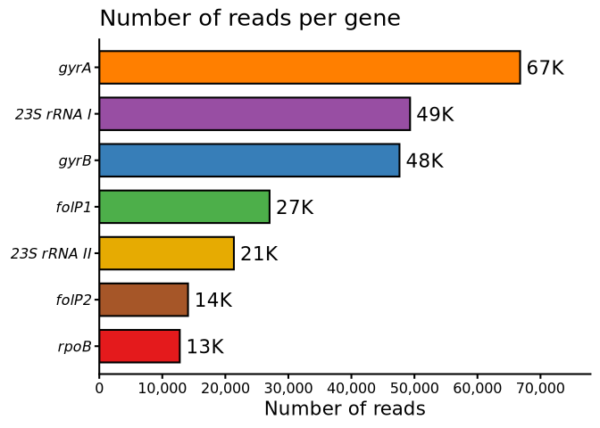
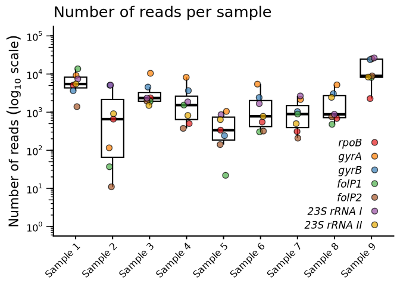

Mean read counts and size
================
2026-07-14

### Generates working dataframe

To work with tidy-compatible data, the .txt file generated from the
scripts needs to be transformed into long format, in terms of metrics
values, and then, again, converting it into wider format setting each
metric name as columns.

Each sample is renamed to a reader-friendly format – no one will
understand our lab sample codes. Gene names were recoded, too.

Finally, this work-friendly dataframe is converted into a .csv file for
further analysis.

``` r
df <- read.delim(here("data/raw_data/alignments/Stats/coverage.txt"),
                 check.names = F)

ampstats <- df %>%
    pivot_longer(cols = colnames(df[, 3:9]),
                 names_to = "GENE",
                 values_to = "VALUE") %>%
    pivot_wider(names_from = "METRIC", values_from = "VALUE")

# New relabeled name (remove lab ID)
sample_names <- paste("Sample", 1:9)

# Scientific-precise gene names
gene_names <- c("rpoB",
                "gyrA",
                "gyrB",
                "folP1",
                "folP2",
                "23S rRNA I",
                "23S rRNA II")

relabeled_ampstats <- ampstats %>%
    mutate(
        SAMPLE = factor(
            SAMPLE,
            levels = unique(ampstats$SAMPLE),
            labels = sample_names
        ),
        GENE = factor(GENE, levels = unique(ampstats$GENE), labels = gene_names)
    )

# Create a new directory to add all processed files
processed_files_path = "data/processed_data"
dir.create(here(processed_files_path), showWarnings = F)

write.csv(relabeled_ampstats,
          here(file.path(processed_files_path, "amplicon_stats.csv")),
          row.names = F)

glimpse(relabeled_ampstats)
```

    ## Rows: 63
    ## Columns: 8
    ## $ SAMPLE    <fct> Sample 1, Sample 1, Sample 1, Sample 1, Sample 1, Sample 1, …
    ## $ GENE      <fct> rpoB, gyrA, gyrB, folP1, folP2, 23S rRNA I, 23S rRNA II, rpo…
    ## $ FREADS    <dbl> 5100, 9181, 3663, 13697, 1392, 7452, 5463, 655, 116, 5074, 3…
    ## $ FVDEPTH   <dbl> 4679, 7559, 2922, 12512, 820, 6867, 4674, 568, 105, 4463, 33…
    ## $ FRPERC    <dbl> 11.100, 19.981, 7.972, 29.810, 3.030, 16.218, 11.890, 5.495,…
    ## $ FDEPTH    <dbl> 4937.3, 8419.8, 3321.4, 12910.6, 1045.8, 7191.3, 5087.4, 622…
    ## $ `FPCOV-1` <dbl> 100, 100, 100, 100, 100, 100, 100, 100, 100, 100, 100, 100, …
    ## $ READSIZE  <dbl> 435, 517, 468, 303, 580, 366, 516, 458, 512, 459, 380, 568, …

### Total reads per gene

To understand how well each amplicon performed on this assay, we can sum
up their number of reads and sort from the best to the worst.

``` r
fill_genes <- c(
    "rpoB" = "#e41a1c",
    "gyrA" = "#ff7f00",
    "gyrB" = "#377eb8",
    "folP1" = "#4daf4a",
    "folP2" = "#a65628",
    "23S rRNA I" = "#984ea3",
    "23S rRNA II" = "#e6ab02"
)

relabeled_ampstats %>%
    group_by(GENE) %>%
    summarise(TOTAL_READS = sum(FREADS)) %>%
    ggplot(aes(
        x = TOTAL_READS,
        y = fct_reorder(GENE, TOTAL_READS),
        fill = GENE
    )) +
    labs(title = "Number of reads per gene", x = "Number of reads", y = NULL) +
    geom_col(width = 0.7, colour = "black", show.legend = F) +
    geom_text(aes(
        label = scales::label_number(
            accuracy = 1,
            scale_cut = scales::cut_short_scale()
        )(TOTAL_READS),
        hjust = 0,
        nudge_x = 1000
    )) +
    scale_x_continuous(
        breaks = seq(0, 70000, by = 10000),
        expand = expansion(mult = c(0, 0.15)),
        labels = scales::label_comma()
    ) +
    scale_fill_manual(values = fill_genes) +
    theme(axis.text.y = element_text(face = "italic"))
```

<!-- -->

All amplicons generated more than 10K reads each. However, *rpoB*, and
*folP2* generated the lowest reads counts (13K and 14K, respectively).
Thus, it is neded to observe the results of other amplicon statistics
(such as depth and distribution) to understand the performance of these
two amplicons.

### Number of reads per sample

The number of reads is related to the coverage of each gene. Getting
this count by samples tell about the quality of bacilli DNA after ExoV
treatment (and also about the quality of our multiplex PCR).

``` r
set.seed(20230407)

relabeled_ampstats %>%
    ggplot(aes(x = SAMPLE, y = FREADS)) +
    labs(
        title = "Number of reads per sample",
        x = NULL,
        y = bquote("Number of reads " (log[10] ~ "scale")),
        fill = NULL
    ) +
    geom_boxplot(
        outliers = F,
        colour = "black",
        width = 0.6,
        linewidth = 0.75
    ) +
    geom_jitter(
        aes(fill = GENE),
        size = 3,
        width = 0.1,
        shape = 21,
        alpha = 0.7
    ) +
    scale_y_continuous(
        breaks = 10 ^ (0:5),
        trans = "log10",
        limits = c(1, 10 ^ 5),
        label = scales::label_log()
    ) +
    scale_fill_manual(values = fill_genes) +
    coord_cartesian(clip = "off") +
    annotation_logticks(sides = "l", outside = T) +
    theme(
        legend.position = c(0.85, 0.25),
        legend.background = element_rect(fill = "transparent", colour = NA),
        legend.text.position = "left",
        legend.text = element_text(face = "italic"),
        axis.text.y = element_text(margin = margin(r = unit(10, "mm"))),
        axis.text.x = element_text(
            angle = 45,
            hjust = 1,
            vjust = 1
        )
    )
```

<!-- -->

Sample 5 and 7 got the lowest number of reads. Maybe it is more
informative to know the number of reads per gene in each sample Also, it
could be nice to know the bacilli index of these two samples.

### Mean read size and coverage

Considering that we want to know the variants in these genes, one should
know about the coverage of each amplicon that our sequencing could
recover.

``` r
ampsize <- c(
  "rpoB"        = 469, 
  "gyrA"        = 575, 
  "gyrB"        = 520, 
  "folP1"       = 797, 
  "folP2"       = 757, 
  "23S rRNA I"  = 405, 
  "23S rRNA II" = 565
)

relabeled_ampstats %>%
    mutate(AMPSIZE = ampsize[as.character(GENE)], COVERAGE = READSIZE / AMPSIZE) %>%
    group_by(GENE, AMPSIZE) %>%
    summarise(
        MEAN_READSIZE = mean(READSIZE),
        SD_READSIZE = sd(READSIZE),
        MEAN_COVERAGE = mean(COVERAGE) * 100,
        SD_COVERAGE = sd(COVERAGE) * 100,
        .groups = "drop"
    ) %>%
    mutate(
        READSIZE_LABEL = sprintf("%.1f ± %.1f", MEAN_READSIZE, SD_READSIZE),
        COVERAGE_LABEL = sprintf("%.1f ± %.1f", MEAN_COVERAGE, SD_COVERAGE)
    ) %>%
    select(GENE, AMPSIZE, READSIZE_LABEL, COVERAGE_LABEL) %>%
    rename(
        Gene = GENE,
        `Amplicon Length (bp)` = AMPSIZE,
        `Mean read length (bp)` = READSIZE_LABEL,
        `Mean read coverage (%)` = COVERAGE_LABEL
    ) %>%
    kable(format = "markdown") %>%
    kable_classic() %>%
    column_spec(1, italic = T)
```

<table class=" lightable-classic" style="color: black; font-family: &quot;Arial Narrow&quot;, &quot;Source Sans Pro&quot;, sans-serif; margin-left: auto; margin-right: auto;">

<thead>

<tr>

<th style="text-align:left;">

Gene
</th>

<th style="text-align:right;">

Amplicon Length (bp)
</th>

<th style="text-align:left;">

Mean read length (bp)
</th>

<th style="text-align:left;">

Mean read coverage (%)
</th>

</tr>

</thead>

<tbody>

<tr>

<td style="text-align:left;font-style: italic;">

rpoB
</td>

<td style="text-align:right;">

469
</td>

<td style="text-align:left;">

430.1 ± 14.3
</td>

<td style="text-align:left;">

91.7 ± 3.0
</td>

</tr>

<tr>

<td style="text-align:left;font-style: italic;">

gyrA
</td>

<td style="text-align:right;">

575
</td>

<td style="text-align:left;">

509.4 ± 5.9
</td>

<td style="text-align:left;">

88.6 ± 1.0
</td>

</tr>

<tr>

<td style="text-align:left;font-style: italic;">

gyrB
</td>

<td style="text-align:right;">

520
</td>

<td style="text-align:left;">

458.8 ± 5.2
</td>

<td style="text-align:left;">

88.2 ± 1.0
</td>

</tr>

<tr>

<td style="text-align:left;font-style: italic;">

folP1
</td>

<td style="text-align:right;">

797
</td>

<td style="text-align:left;">

447.2 ± 136.8
</td>

<td style="text-align:left;">

56.1 ± 17.2
</td>

</tr>

<tr>

<td style="text-align:left;font-style: italic;">

folP2
</td>

<td style="text-align:right;">

757
</td>

<td style="text-align:left;">

575.7 ± 21.3
</td>

<td style="text-align:left;">

76.0 ± 2.8
</td>

</tr>

<tr>

<td style="text-align:left;font-style: italic;">

23S rRNA I
</td>

<td style="text-align:right;">

405
</td>

<td style="text-align:left;">

362.7 ± 6.6
</td>

<td style="text-align:left;">

89.5 ± 1.6
</td>

</tr>

<tr>

<td style="text-align:left;font-style: italic;">

23S rRNA II
</td>

<td style="text-align:right;">

565
</td>

<td style="text-align:left;">

501.3 ± 9.5
</td>

<td style="text-align:left;">

88.7 ± 1.7
</td>

</tr>

</tbody>

</table>

Overall, more than 70% of all amplicons – except *folP1* – could be
recovered. Maybe, *folP1* mean read size was biased by its number of
reads in samples 2 and 5. In both, *folP1* was the least sequenced gene.
Again, the bacilli index of these samples can provide interesting
insights. Could *M. leprae* genome be degraded in low bacillary index
samples?
