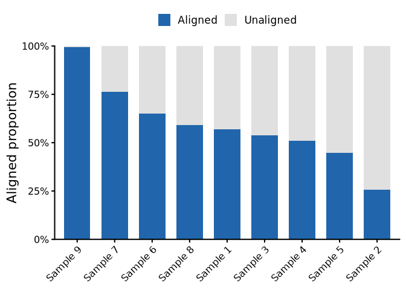

Proportion of aligned and unaligned reads
================
2026-07-15

### Number of aligned and unaligned reads

``` r
df <- read.delim(here("data/raw_data/alignments/Stats/alignment.txt"),
                 check.names = F)

glimpse(df)
```

    ## Rows: 9
    ## Columns: 7
    ## $ SAMPLE    <chr> "5160", "5181", "5390", "5400", "5555", "5560", "5587", "566…
    ## $ TOTAL     <int> 108636, 63655, 69078, 49401, 10762, 22617, 12415, 28944, 125…
    ## $ ALIGNED   <int> 61897, 16320, 37098, 25225, 4815, 14683, 9461, 17096, 124729
    ## $ BOTH      <int> 37210, 10118, 20384, 13031, 2559, 8850, 6761, 10900, 90348
    ## $ FORWARD   <int> 11014, 3036, 9175, 5838, 940, 1762, 1067, 2419, 16969
    ## $ REVERSE   <int> 12508, 2894, 6834, 5810, 1214, 3784, 1506, 3561, 16085
    ## $ UNALIGNED <int> 46739, 47335, 31980, 24176, 5947, 7934, 2954, 11848, 696

### Distribution of aligned and unaligned reads

The proportion of reads that align to the amplicon sequences can tell
about how well we were able to recover the sequences of each amplicon.

In this sense, these values will tell us if we were able to get enough
reads from slit skin smears.

``` r
relabeled_alnstats <- df %>%
    mutate(SAMPLE = factor(
        SAMPLE,
        levels = unique(df$SAMPLE),
        labels = paste("Sample", 1:9)
    ))

relabeled_alnstats %>%
    mutate(
        prop_aligned = ALIGNED / TOTAL * 100,
        prop_unaligned = UNALIGNED / TOTAL * 100,
        prop_f = FORWARD / ALIGNED * 100,
        prop_r = REVERSE / ALIGNED * 100,
        prop_both = BOTH / ALIGNED * 100
    ) %>%
    mutate(
        aln_label = sprintf("%d (%.1f%%)", ALIGNED, prop_aligned),
        unaln_label = sprintf("%d (%.1f%%)", UNALIGNED, prop_unaligned),
        f_label = sprintf("%d (%.1f%%)", FORWARD, prop_f),
        r_label = sprintf("%d (%.1f%%)", REVERSE, prop_r),
        both_label = sprintf("%d (%.1f%%)", BOTH, prop_both),
        total_recoded = label_number(
            scale = 1e-3,
            accuracy = 1,
            suffix = "k"
        )(ALIGNED)
    ) %>%
    select(SAMPLE,
           total_recoded,
           aln_label,
           unaln_label,
           both_label,
           f_label,
           r_label) %>%
    rename(
        Sample = SAMPLE,
        Total = total_recoded,
        Aligned = aln_label,
        `Aligned with both primers` = both_label,
        `Aligned with forward` = f_label,
        `Aligned with reverse` = r_label,
        Unaligned = unaln_label
    ) %>% 
    kable() %>% 
    kable_classic()
```

<table class=" lightable-classic" style="color: black; font-family: &quot;Arial Narrow&quot;, &quot;Source Sans Pro&quot;, sans-serif; margin-left: auto; margin-right: auto;">

<thead>

<tr>

<th style="text-align:left;">

Sample
</th>

<th style="text-align:left;">

Total
</th>

<th style="text-align:left;">

Aligned
</th>

<th style="text-align:left;">

Unaligned
</th>

<th style="text-align:left;">

Aligned with both primers
</th>

<th style="text-align:left;">

Aligned with forward
</th>

<th style="text-align:left;">

Aligned with reverse
</th>

</tr>

</thead>

<tbody>

<tr>

<td style="text-align:left;">

Sample 1
</td>

<td style="text-align:left;">

62k
</td>

<td style="text-align:left;">

61897 (57.0%)
</td>

<td style="text-align:left;">

46739 (43.0%)
</td>

<td style="text-align:left;">

37210 (60.1%)
</td>

<td style="text-align:left;">

11014 (17.8%)
</td>

<td style="text-align:left;">

12508 (20.2%)
</td>

</tr>

<tr>

<td style="text-align:left;">

Sample 2
</td>

<td style="text-align:left;">

16k
</td>

<td style="text-align:left;">

16320 (25.6%)
</td>

<td style="text-align:left;">

47335 (74.4%)
</td>

<td style="text-align:left;">

10118 (62.0%)
</td>

<td style="text-align:left;">

3036 (18.6%)
</td>

<td style="text-align:left;">

2894 (17.7%)
</td>

</tr>

<tr>

<td style="text-align:left;">

Sample 3
</td>

<td style="text-align:left;">

37k
</td>

<td style="text-align:left;">

37098 (53.7%)
</td>

<td style="text-align:left;">

31980 (46.3%)
</td>

<td style="text-align:left;">

20384 (54.9%)
</td>

<td style="text-align:left;">

9175 (24.7%)
</td>

<td style="text-align:left;">

6834 (18.4%)
</td>

</tr>

<tr>

<td style="text-align:left;">

Sample 4
</td>

<td style="text-align:left;">

25k
</td>

<td style="text-align:left;">

25225 (51.1%)
</td>

<td style="text-align:left;">

24176 (48.9%)
</td>

<td style="text-align:left;">

13031 (51.7%)
</td>

<td style="text-align:left;">

5838 (23.1%)
</td>

<td style="text-align:left;">

5810 (23.0%)
</td>

</tr>

<tr>

<td style="text-align:left;">

Sample 5
</td>

<td style="text-align:left;">

5k
</td>

<td style="text-align:left;">

4815 (44.7%)
</td>

<td style="text-align:left;">

5947 (55.3%)
</td>

<td style="text-align:left;">

2559 (53.1%)
</td>

<td style="text-align:left;">

940 (19.5%)
</td>

<td style="text-align:left;">

1214 (25.2%)
</td>

</tr>

<tr>

<td style="text-align:left;">

Sample 6
</td>

<td style="text-align:left;">

15k
</td>

<td style="text-align:left;">

14683 (64.9%)
</td>

<td style="text-align:left;">

7934 (35.1%)
</td>

<td style="text-align:left;">

8850 (60.3%)
</td>

<td style="text-align:left;">

1762 (12.0%)
</td>

<td style="text-align:left;">

3784 (25.8%)
</td>

</tr>

<tr>

<td style="text-align:left;">

Sample 7
</td>

<td style="text-align:left;">

9k
</td>

<td style="text-align:left;">

9461 (76.2%)
</td>

<td style="text-align:left;">

2954 (23.8%)
</td>

<td style="text-align:left;">

6761 (71.5%)
</td>

<td style="text-align:left;">

1067 (11.3%)
</td>

<td style="text-align:left;">

1506 (15.9%)
</td>

</tr>

<tr>

<td style="text-align:left;">

Sample 8
</td>

<td style="text-align:left;">

17k
</td>

<td style="text-align:left;">

17096 (59.1%)
</td>

<td style="text-align:left;">

11848 (40.9%)
</td>

<td style="text-align:left;">

10900 (63.8%)
</td>

<td style="text-align:left;">

2419 (14.1%)
</td>

<td style="text-align:left;">

3561 (20.8%)
</td>

</tr>

<tr>

<td style="text-align:left;">

Sample 9
</td>

<td style="text-align:left;">

125k
</td>

<td style="text-align:left;">

124729 (99.4%)
</td>

<td style="text-align:left;">

696 (0.6%)
</td>

<td style="text-align:left;">

90348 (72.4%)
</td>

<td style="text-align:left;">

16969 (13.6%)
</td>

<td style="text-align:left;">

16085 (12.9%)
</td>

</tr>

</tbody>

</table>

Except for samples 2 and 5, more than 50% of the reads were aligned to
the target sequences in all samples. The majority of the reads had both
forward and reverse primers. However, only in 7 and 9 more than 70% of
the reads had both primers.

### Proportion of aligned x unaligned

Just a better visualisation of the proportion of aligned and unaligned
reads per sample.

``` r
relabeled_alnstats %>%
    mutate(aligned_prop = ALIGNED / TOTAL) %>%
    select(SAMPLE, UNALIGNED, ALIGNED, aligned_prop) %>%
    pivot_longer(
        cols = c(UNALIGNED, ALIGNED),
        names_to = "reads",
        values_to = "number"
    ) %>%
    ggplot(aes(
        x = fct_reorder(SAMPLE, -aligned_prop),
        y = number,
        fill = reads
    )) +
    labs(x = NULL, y = "Aligned proportion", fill = NULL) +
    geom_col(width = 0.7, position = position_fill(reverse = T)) +
    scale_y_continuous(expand = expansion(), labels = label_percent()) +
    scale_fill_manual(labels = c("Aligned", "Unaligned"), values = c("#2166ac", "#e0e0e0")) +
    theme(legend.position = "top",
          axis.text.x = element_text(angle = 45, hjust = 1, vjust = 1))
```

<!-- -->

Notably, the two samples with the lowest number of reads had the lowest
proportion of aligned reads. Again, this can be related to the bacillary
index of those samples. Even so, we were able to sequence a
significative amount of sequences in all samples.
