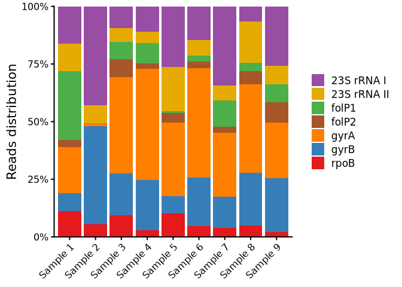

Proportion of reads distribution per amplicon
================
2026-07-16

### Reads distribution

My objective here is to compare the proportion of reads distribution per
amplicon in each sample.

``` r
amp_distribution <- read.csv(here("data/processed_data/amplicon_stats.csv"),
                             check.names = F) %>%
    select(SAMPLE, GENE, FRPERC)

fill_genes <- c(
    "rpoB" = "#e41a1c",
    "gyrA" = "#ff7f00",
    "gyrB" = "#377eb8",
    "folP1" = "#4daf4a",
    "folP2" = "#a65628",
    "23S rRNA I" = "#984ea3",
    "23S rRNA II" = "#e6ab02"
)

amp_distribution %>%
    ggplot(aes(x = SAMPLE, y = FRPERC, fill = GENE)) +
    labs(x = NULL, y = "Reads distribution", fill = NULL) +
    geom_col(position = position_fill()) +
    scale_y_continuous(expand = expansion(), labels = label_percent()) +
    scale_fill_manual(values = fill_genes) +
    theme(axis.text.x = element_text(angle = 45, hjust = 1, vjust = 1))
```

<!-- -->

Across the sequenced amplicons, *gyrA* and *gyrB* where the ones with
the best sequencing performance. The worst were *rpoB* and *folp1*, as
well as *folP1* (however, not as the two before). Maybe this indicates
that minor adjustments are needed on the multiplex PCR optimisation.
